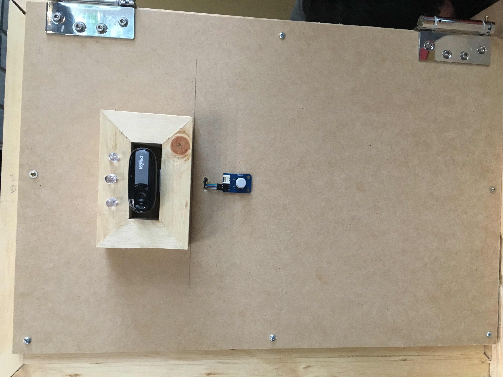
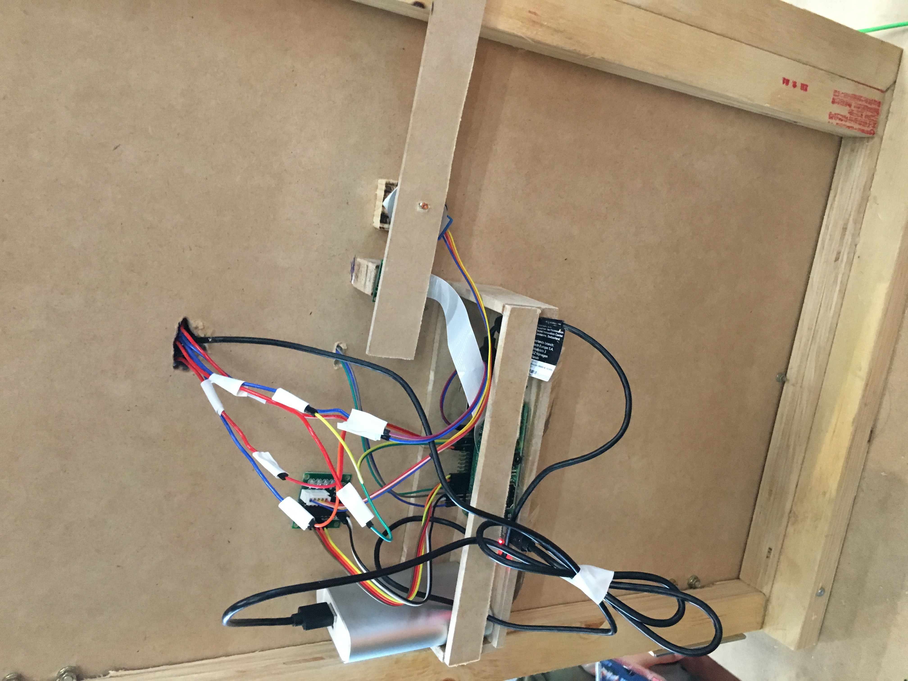
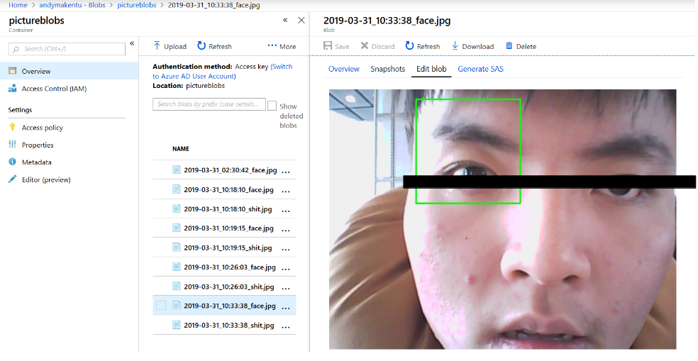
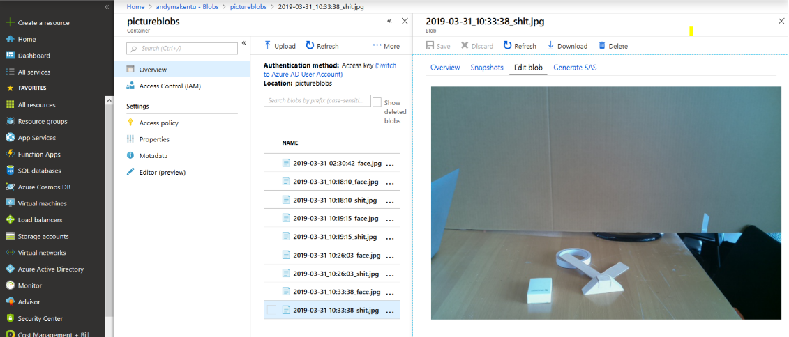

### MakeNTU2019
# Smart Toilet Door System

## Motivatoin
We are boarders in Colleage, and we have to share some resources with others in the same dormitory. However, some people just are not pay attention to 
maintaining public area clean. We often see someone's shit when openning toelit's door, and this definitely ruins our day. As a result, we want to design 
a system to solve this problem, and raise people's awareness about this.

## Scenario
1. When user wants to enter a toilet, he/she must recognized by the camera on the door, the system would store the user's faces.
2. After 'Resister' the toilet, the green light on the door shines, and user can push the button on the door to open it. (Before this, the door is locked)
3. After using the toilet, user must flush so the door can be open (the lock is controled by the system and doesn't allow to be open by hand)
4. After the user left, the camera inside the door would check if the environment is the same as before, in case that someone left some surprise on the floor.
5. If the user didn't keep the environment clean, the camera would upload the user's face and the criminal scene to Azure cloud service, which can only be accessed by some one manages this.
6. The yellow light on the door would shine to warn others not to open the door until the floor is cleaned.

## Materials
* RaspberryPi * 2
* stepper motor * 1
* button * 2
* LED * 3 (different color)
* WebCam * 1
* PiCamera * 1
* Azure cloud service
* Some boards for making a door

## Project structure
The RaspberryPi on the door controls almost all devices. Including:
* 3 LED light   -> show information
* Stepper motor -> control the lock 
* WebCam outside the door -> use OpenCV resources to detect human face, and take pictures.
* PiCamera inside the door  -> use OpenCV reources to detect if the environment is the same.
* Azure Cloud Services -> send images and record the time.

There's another raspberryPi, which represent the trigger of the flusher, once the button is pushed,
it would send signal to the RaspberryPi on the door to make it unlock.

## Results

### front view 

### Back view

### Suspect's face uploaded

### The toilet's scene after non-proper usage

## Challenge 

### 1. Security Issue
People might concern about the camera inside the door. However, in our design, The camera would definitely blocked if the door is locked.
It can only "see" something when the door is unlocked. So when using the toilet, the user is safe. Once the camera is hacked,
the door can't be locked either, so the user would find it and refuse to use it. But there's still some controversy over this issue.

### 2. Detecting shit in the toilet
The biggest challenge in this project is too determine if two images are the same.
One simple idea is to directly get the difference of RGB value for each pixel, and sum up.
But this method are very astable, because two scene are taken at different time, so there 
might be a slight difference in light color, which would lead to determining two picture are different
even if they are almost the same. So we transform image into grey scale, compute its border, which 
discard the color information and focus on the contour of the object.(We use Canny() function in 
OpenCV to do that.) The score of the image is the sum of the contour value, if two image's score
are different by more than the threshold value, then they are differnt images.
